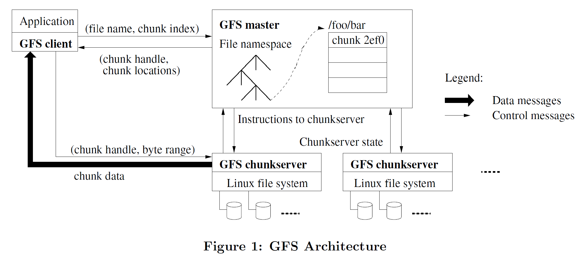

# Distributed File Storage System with Fault Tolerance
## Introduction
A file storage application which virtualizes the storage of files on a distributed network and also facilitates a serverless state. The network infrastructure is decentralized with the capability for the peers to be distributed around the global network. The current design also incorporates a single-point of contact system (which a facility to extend it to multiple-point of contact system) where one server chosen to be the master, maintains the directory for the peer servers and backup server. By doing so, it provides the information about where to store and retrieve the files. The system is designed to be fault-tolerant and consistent by maintaining and providing complete availability and data replication.

## Why Distributed?
The applications to provide support to large amounts of data for either storage or processing.  And thus, to be able to achieve this goal, serverless architecture is the optimal choice in the terms that the customer can always achieve or acquire his required specifications without any additional processing and improves the performance of the application by decreasing the infrastructure setup load on it.

## Google Distributed File System Architecture

## Pre-requisites
* ### Golang
  The application is designed using golang. This is because, golang provides support for concurrency by spawning seperate go-routines, which are stateful threads, and not maintaining any global-lock on the threads or  routines spawned.
  Also, having the capability of C programming language and syntactical ease to implement several features, golang was the go-to choice.
* The systems on which the client, master and peers executed needs to support network drivers to create sockets and go lang compiler.
* The implementation environment independant as long as the the above pre-requisites are satisfied.

## Key Components and their Functionalities:
### Client
Client is a user who has the capability to store and request the file from the system. He is given a command line interface which processes the commands and interacts with the master in different ways based on the processed commands.

> SEND filename.ext  
The CLI processes the command as a SEND type and extracts the file name from the command. It creates a SEND packet and forwards the request to the master.   
On Successful processing, master returns the Primary and Backup Peers network addresses. The client then creates a file map and caches the primary and backup peer addresses. As the backend system does not move the first segment of the file chunk from the primary peer, caching the details helps the client communicate or retrieve the file efficiently from the storage.

> RECEIVE filename.ext 
The CLI processes the command as a RECEIVE type and extracts the file name from the command. It creates a SEND packet and forwards the request to the primary peer by retrieving its value from the cache.
  It performs a connect operation with the primary peer, if it receives an acknowledgment that the peer is ready to transmit the packet back to the client, it prepares to receive the file by opening a Input and Output reader and writer.  
When the connection with the primary peer fails, the client contacts the backup peer stored in the cache. And performs the above said steps again until it reaches the timeout interval. If the client does not receive any confirmation from the peers by the timeout interval, it requests the master to provide the network addresses of the peers again.

### Master

Master is the primary source of contact or public point of contact representing the distributed file storage system. It does not have any fail over mechanism in place yet, but given the implementation strategies in place, the master can be made to have a fault tolerant backup and thus, allowing the system to have complete availability. The master is maintained by the organization or the application user who wishes to maintain and provide the backend resources to the application or can be exported to the any other parties.

The jobs performed by master can be listed as:
1. It maintains a directory of peers and its backups in its cache, and thus allowing the system to have less overhead in retrieving information.
2. It maintains a one-to-one primary to backup peers whenever a request to join from a peer is received.
3. It sends a heartbeat pings to the peers for every 200 milliseconds and updates it cache respectively if any of the peers are down.
4. It computes the hash of the filename and peer network address and compares them to chose the file storage location.  
<pre><code>
a. If the hash of the file is smaller than the peer hash, the file is stored with the peer.
b. If the hash of the file is greater than the peer hash, the file is stored with the peer with the next highest hash value.
c. If the hash of file is greater than the hahs of all the peers, the file is stored with the peer of highest hash.
</code></pre>
5. It processes the request from the client and sends the peer information based on the filename.

### Peer

Peer in this context is referred to as the primary peer which initially is contacted by the client and stores the data. The application is designed to have a cluster of primary peers supported by a cluster of backup peers maintaining a one-to-one mapping between them. The main functionality of the primary peer is to store and retrieve the data chunks of the file stored with it.

The key jobs of the primary peer would include:
1. It responsible for creating the input and output file reader and writers for any kind of file extensions.
2. It is responsible to indicate the client of the availability and should perform pre-processing before its acknowledges its availability.
3. The peer is responsible for maintaining an active state between the client and peer.
4. It is also responsible for closing the connections and releasing any other resources acquired for the task.
5. It needs to update its backup peer with the file recently received and open an connection with the backup peer to transfer the file.

### Backup Peer

Backup Peer is chosen by the master and maintains continuous availability to process any request from the peer or the master. The backup peer is configured in the same configurations as the primary and thus allows the system to maintain an active state when the primary server fails.

The key jobs of the backup peer can be listed as:
1. Backup peer is responsible for updating the primary of its existence when the master has chosen this node to be the backup.
2. It is also responsible for maintaining the connection established by the primary until its contents are transferred over to the backup.
3. It is also responsible to release any acquired resources to store the file in its storage.

## Use-cases

The application, being serverless, is capable of scaling its infrastructure, based on the use-case. The application is built by envisioning a workspace being used as data hub or center. With it's current system design, the application can be used vertically within an organization or used as public cloud interface providing users with the capabilities of file storing and retrieval.

* #### As a data center:
The application can be setup as a data center, where the servers or RDS storage systems can act as peers and similar configured RDS systems can also act as backups to each other. Where as, the CLI can be presented to the admin or any user registered with the data center and thus, implicitly provides a fault-tolerant reliable storage system.

## Non-goals
The application is designed as a storage system and with it's current design, cannot be treated as edge network to transfer the data, where by considering the peers as intermediate nodes. The interaction with the nodes is limited only to the user and client registered with it application. Any other user-interface interaction with it peers does not yield any kind of response.

Application infrastructure needs to be setup before it can be distributed as a public application. Thus, any user with the resources can setup the infrastructure and deploy their instance to be used.

## Implementation Drawbacks and Future Works

1. The key drawback of the fault-tolerant system is that the master node, though designed to be fault-tolerant, is not yet implemented to be a rollover system. The key issues in implementation would be that the master node needs to be atomically synced and roll over on the predesignated network policies for the application to maintain constant state. This is a work-in-progress and a key point step in further development.

2. The System maintains a one-to-one mapping with the primary-to-backup and when the backup peer in the cluster fails, the data is forever lost and there is no other fail-safe.

3. The application does not provide a user-interface to the client for easier access and thus restricts the client functionality.

4. Command line currently accepts only SEND and RECEIVE commands and all other commands are under development.

5. If more than one client is connected to the system, the client who is reading the data will be not be able to read the data until the file modifications are written to the disk. The system achieves eventual consistency in this manner.

6. A work-in-progress, where the system achieves consistency by trading off efficiency by maintaining a consistent state with all the clients accessing the file in any manner.
